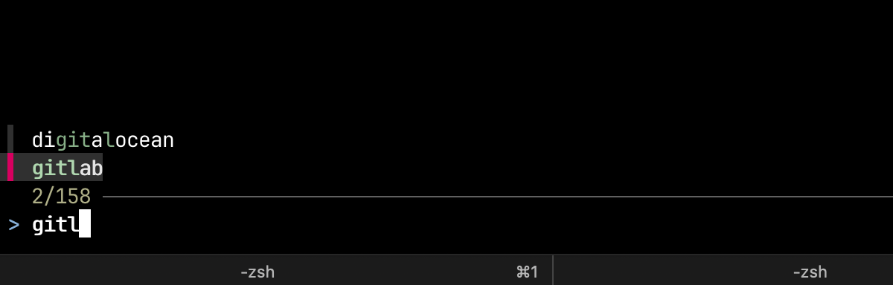

# Passmenu – macOS popup menu to search for pass passwords



Passmenu is a lightweight popup menu for macOS / Darwin that helps you quickly search for passwords managed with `pass` and paste them into any app.  
Unlike the original, this version leverages `fzf` for fast, interactive selection.

# Install

## Brew

```bash
brew tap ub-3/tap
brew install passmenu
```

Or you can simply download the script and install it into `/usr/local/bin`

```bash
curl -Ls https://github.com/ub-3/passmenu/archive/refs/tags/v1.0.0.tar.gz | tar -xz -C /tmp passmenu-1.0.0/passmenu \
    && sudo mv /tmp/passmenu-1.0.0/passmenu /usr/local/bin/passmenu \
    && sudo chmod +x /usr/local/bin/passmenu
```

## Features
- macOS / Darwin native
- Interactive password search and paste with fzf
- Compatible with Pass password manager
